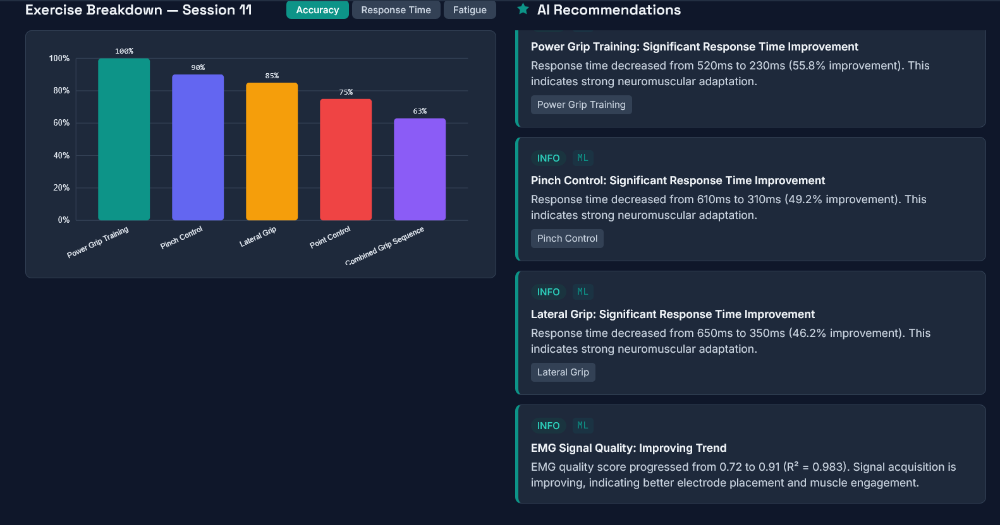

# Solution — Challenge B: AI Programming & UX

**Live Demo:** [https://challenge-b-kappa.vercel.app](https://challenge-b-kappa.vercel.app)

## Name
Hrishikesh Bywar

## Approach

I built a single-page Rehabilitation Dashboard that loads real patient session data, visualizes rehabilitation metrics with three interactive D3.js charts, and generates ML-powered recommendations using client-side linear regression models. The dashboard is designed for clinical use by therapists and patients — prioritizing legibility, data hierarchy, and calm professionalism over flashy consumer aesthetics.

The architecture follows a clear separation of concerns: data utilities and ML logic are pure functions with no UI coupling, React hooks manage stateful concerns (data fetching, theme, simulation), and components handle rendering. D3.js is integrated into React via `useRef` + `useEffect` with ResizeObserver for responsive chart containers.

### Tech Stack

| Layer | Choice | Why |
|-------|--------|-----|
| Framework | React 18 (Vite) | Component architecture maps naturally to the dashboard's panel/card structure. Vite gives zero-config, fast HMR. |
| Charting | D3.js v7 | Hand-built SVG visualizations (line, bar, multi-line) demonstrate lower-level data-viz control and allow full customization of the clinical aesthetic. |
| Styling | Tailwind CSS v3 + custom CSS | Tailwind for responsive layout utilities and dark mode (`darkMode: 'class'`). Custom CSS for the clinical design system — chart containers, print stylesheet, skeleton animations, focus states. |
| ML | Ordinary Least Squares linear regression (hand-implemented) | For 10 sessions with clear linear trends, implementing OLS directly is more appropriate than importing a heavy ML framework. Produces R² scores, slope/intercept, and next-session predictions per exercise. |
| Fonts | Space Grotesk / Inter / JetBrains Mono | Technical display typeface for headings, clean humanist sans for body, monospace for data readouts — a deliberate typographic hierarchy for clinical readability. |

### Design Decisions

**Target users**: Rehabilitation therapists (Dr. Tanaka) and patients (Patient A). The interface must be scannable in under 2 seconds for key metrics, detailed enough for clinical record-keeping, and printable for patient charts.

**Visual language**: Clinical instrument-panel — not a consumer SaaS dashboard. Cool slate backgrounds with a restrained teal accent (#0d9488) used only for the primary accent, active states, and the simulation indicator. Summary cards read like instrument readouts (monospace numerals, small-caps tracked labels, thin teal left-border). Status colors (red/amber/green) appear only for data-driven indicators, never decoratively.

**Layout order**: Summary cards → Progress chart → Exercise breakdown + Recommendations (side by side) → Fatigue analysis → Session history. This follows the clinical workflow: glance at status → check trends → review specifics.

**Dark mode**: Class-based toggle with localStorage persistence and system preference detection. All D3 charts re-render with theme-appropriate axis/grid/text colors.

### AI Recommendations

The recommendation engine (`src/ml/recommendationEngine.js`) uses linear regression models trained on per-exercise time-series data. For each exercise type, it fits an OLS model on accuracy, fatigue, and response time vs. session index, then predicts next-session values. Six rules consume the ML predictions:

1. **Mastery Progression** — Exercise accuracy > 80% for the last 3 sessions AND regression predicts > 85% next session → recommend advancing difficulty. Cites the actual accuracy values (e.g., "82% → 85% → 88% → 90%").

2. **Fatigue Alert** (high priority) — Latest fatigue > 0.6 or predicted fatigue > 0.65 → recommend reducing load. Cites the fatigue index value.

3. **New Exercise Ramp-up** — Exercise present in < 4 sessions with latest accuracy < 60% → recommend focused practice. Cites the learning curve progression.

4. **EMG Quality Trend** — Linear regression on `emg_quality_score` across sessions → notes improvement or decline. Cites start/end values and R² coefficient.

5. **Response Time Improvement** — Response time decreased > 40% from first to latest appearance → highlights motor-pathway adaptation. Cites ms values and percentage change.

6. **Plateau Detection** — Predicted accuracy gain < 2% with current accuracy between 60–80% → warns about potential plateau.

Every recommendation cites specific data points from the patient's record — no generic filler.

### Accessibility

- Semantic HTML: `<header>`, `<main>`, `<section>`, `<article>`, single `<h1>`, proper heading hierarchy
- Keyboard navigation: all interactive elements reachable via Tab, operable via Enter/Space
- Visible focus states: teal ring (`ring-2 ring-clinical-500`) on all focusable elements
- ARIA: `aria-expanded` on session toggles, `role="img"` + `aria-label` on D3 SVGs, `role="dialog"` + `aria-modal` on comparison modal, Escape to close
- WCAG AA contrast in both light and dark modes
- Status indicators use color + text — never color alone
- `@media (prefers-reduced-motion: reduce)` disables all animations
- Print stylesheet hides interactive chrome, forces light background, page-break-avoids on charts

## How to Run

```bash
# Navigate to the project directory
cd challenges/challenge-b

# Install dependencies
npm install

# Start development server
npm run dev
# Dashboard available at http://localhost:5173/

# Production build
npm run build

# Preview production build
npm run preview
```

The dashboard loads patient data from `public/data/patient_sessions.json`. If the fetch fails (e.g., opening via `file://`), it falls back to an embedded copy — the dashboard always works.

## Screenshots


## Bonus

### Dark/Light Mode Toggle
Sun/moon icon toggle in the header. Persists preference to localStorage, respects `prefers-color-scheme` on first visit. All D3 charts re-render with theme-appropriate colors.

### Session Comparison
Select any two sessions from the session list or via the Compare modal. Side-by-side display with per-exercise deltas and clear improvement/decline indicators (▲ green / ▼ red) with correct directionality (for fatigue, lower = better).

### Print/Export Report
"Print" button triggers `window.print()` with a dedicated print stylesheet optimized for A4. Hides interactive controls, forces light background, renders charts as static SVGs.

### Live Session Simulation
"Start Live Session" extrapolates a plausible Session 11 from existing trends using the same linear regression models. Exercises appear one-by-one with staggered timing. Simulated session is visually distinct (dashed border, pulsing teal indicator, "SIMULATED" badge). Respects `prefers-reduced-motion`.
